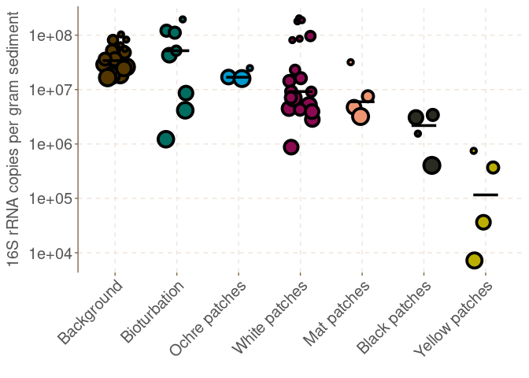

qPCR_analysis
================
Sven Le Moine Bauer
2022-11-24

## Introduction

Here we will go through the code needed to plot the qPCR-based absolute
abundance figures (2D and 3). The only one file needed is the Metadata
file.

## Loading and preparing the data.

Let’s start by loading the libraries and set up the working directory

``` r
library(dplyr)
library(ggplot2)
library(ggthemr)
library(ggpubr)
library(scales)
# Set directory
setwd(dirname(rstudioapi::getActiveDocumentContext()$path))
```

Now we can import the data. The file should be in the same directory as
the script. The file can be found on the Github.

``` r
# Import data, without the mats.
qPCRtable <- read.csv("Metadata.csv", row.names=1, sep = ",")
# remove the 0/NA depth samples, as well as the samples of the Saganaki dataset (no qPCR data).
qPCRtable<-subset(qPCRtable, Depth!="NA" & Depth!=0 & Dataset == "Cardhynal")
# Factorise the order of seafloor type.
qPCRtable$Seafloor_type <- factor(qPCRtable$Seafloor_type, levels = c("Background", "Bioturbation","Ochre patches", "White patches", "Mat patches", "Black patches", "Yellow patches"))
qPCRtable <- qPCRtable[order(qPCRtable$Seafloor_type, qPCRtable$Core, qPCRtable$Depth),]
# Make colour palette
colours_seafloor <- c("#533600", "#006D61", "deepskyblue3", "deeppink4", "lightsalmon2", "#2B2B21", "#BAAE00")
# Create a duplicate variable of seafloor to be able to deal with the facet-wrap in figure 3
qPCRtable <- qPCRtable %>% mutate(Seafloor_type2=Seafloor_type)
```

## The 16S total abundance per seafloor type plot (Figure 2D)

The total 16S is considered to be the sum of bacerial and archaeal 16S.
The plot uses geom_jitter grouped per seafloor types.

``` r
ggthemr("fresh")
ggplot(qPCRtable, aes(x=Seafloor_type, y=Uni_avg)) +
  geom_jitter(aes(size = Depth, fill = Seafloor_type, colour = Dataset), shape = 21, width = 0.2, stroke = 2) +
  stat_summary(fun=median, geom="crossbar", size=0.5, color="black", width = 0.4) +
  scale_colour_manual(values = "black") +
  scale_fill_manual(values = colours_seafloor) +
  scale_y_log10() +
  theme(
    legend.position="None",
    axis.text.x = element_text(size = 15, angle = 45, hjust = 1, vjust = 1),
    axis.text.y = element_text(size = 15),
    axis.title.y = element_text(size = 15),
    strip.text.x = element_blank(),
    panel.spacing.x = unit(1, "lines"),
    axis.line.x = element_blank()) +
  labs(x = element_blank(), y = "16S rRNA copies per gram sediment")
```

<!-- -->

## The plots of various gene abundances (Fig 3)

The code to make this spaghetti plot has been found there:
<https://www.data-to-viz.com/caveat/spaghetti.html>. Here I show only
the code for the bacterial 16S gene, but the code can be adapted to the
other genes just by changing the variable plotted. As seen the code does
not specify the dimensions of the output window…

``` r
ggthemr("fresh")
ggplot(qPCRtable, aes(x=X16SBac_avg, y=Depth, group=Core, color=Seafloor_type, xmin=X16SBac_avg-X16SBac_stdev, xmax=X16SBac_avg+X16SBac_stdev)) +
  geom_path(data=qPCRtable %>% dplyr::select(-Seafloor_type), aes(group=Core), color="grey", size=0.5, alpha=1) +
  geom_path(size=1) +
  geom_errorbarh(height = 0, size = 1) +
  scale_color_manual(values = colours_seafloor) +
  scale_y_reverse(breaks = c(15,10,5), limits = c(16,2)) +
  scale_x_log10(NULL,
                breaks = trans_breaks("log10", function(x) 10^x),
                labels = trans_format("log10", math_format(10^.x))) +
  theme(
    legend.position="none",
    plot.title = element_text(size=15, vjust = -1),
    axis.text.x = element_text(angle = 45, hjust = 1, size = 9),
    axis.text.y = element_text(size = 10),
    strip.text.x = element_text(size = 12, face = "bold"),
    strip.placement = "outside",
    panel.spacing.x = unit(1, "lines"),
    plot.margin=unit(c(0.2,0.2,0,0),"cm")) +
  labs(y = "Depth (cm)", x = "Copies per gram sediment") +
  ggtitle("Gene copies per gram sediment") +
  facet_wrap(~Seafloor_type, nrow = 1, switch = "x")
```

<!-- -->
